<p align="center">
  
</p>

<h1 align="center">🙏 KARMA GPT – AI Career Counselor with Spiritual Wisdom 🙏</h1>

<p align="center">
  <b>Modern AI meets Ancient Bhajan Marg Wisdom for career & life guidance</b><br>
  <i>"मिला तो उनकी कृपा, ना मिला तो उनकी इच्छा!"</i><br>
  <sub>— Premanand Maharaj Ji</sub>
</p>

---

## 🌟 What is KARMA GPT?

**KARMA GPT** is an innovative career guidance platform that merges cutting-edge AI/ML (TensorFlow.js, NLP, sentiment analysis) with the timeless teachings of Premanand Maharaj Ji (Bhajan Marg, Vrindavan).  
It’s designed for freshers, job seekers, and anyone facing career stress, providing holistic solutions—technical **and** spiritual.

<div align="center">
  
</div>

---

## 🚀 Features

| AI/ML Career Tech        | Spiritual Bhajan Marg Wisdom    |
|:------------------------:|:------------------------------:|
| Career Problem Classification | Personalized Satsang Recommendations |
| Sentiment & Stress Detection   | Karma & Surrender Philosophy         |
| NLP (Hindi/English)            | Divine Quotes & Teachings           |
| TensorFlow.js Inference        | Bilingual Support                   |
| Personalized Action Steps      | Inner Peace & Practical Advice      |

---

## 📈 How KARMA GPT Works

```mermaid
graph TD
    A[User submits career problem & stress level] --> B[NLP engine analyzes the text]
    B --> C[ML classifier categorizes problem]
    C --> D[Sentiment AI detects emotion]
    D --> E[Maharaj Ji’s relevant satsangs recommended]
    E --> F[Spiritual guidance + action plan delivered]
```



---

## 🛠️ Tech Stack

- **Frontend:** React.js, Lucide Icons, CSS3
- **AI/ML:** TensorFlow.js, Natural.js, ML-Matrix, Compromise.js
- **Backend (optional):** Python Flask + scikit-learn
- **Deployment:** Vercel / Netlify

---

## 📦 Quickstart

```bash
git clone https://github.com/Sakshi983-cmd/PREMA-KARMAGPT.git
cd PREMA-KARMAGPT
npm install
npm start
```

---

## 🧑‍💻 Example AI Pipeline

```javascript
// NLP + ML Career Analysis (src/components/AIEngine.js)
const analysis = await karmaAI.analyzeCareerProblem(problemText, userProfile);
// Returns: classification, stress level, spiritual advice, video recommendations
```

---

## 🎨 UI Preview


---

## 📺 Sample Satsang Recommendation

- **Problem:** Career Anxiety  
- **Recommended Video:** "Bhagwan Par Bharosa Kaise Rakhen"  
- **Quote:** "जो भगवान पर छोड़ देता है, वो कभी परेशान नहीं रहता"

---

## 🔍 Why is KARMA GPT Unique?

- **First-of-its-kind fusion** of career AI with Indian spirituality  
- Created as a fresher ML engineer using [Claude.AI](https://claude.ai/public/artifacts/53575124-feca-4cc5-a94f-bcf647c4673e) for brainstorming and research  
- Designed for entry-level engineers and seekers to discover new technology and spiritual support  
- **Empowers you to find both career clarity and inner peace!**

---

## 🤝 Contributing

1. Fork & clone the repo
2. Create a feature branch
3. Commit your changes
4. Open a Pull Request!

---

## 📄 License

MIT License

---

## 🙏 Acknowledgments

- **Premanand Maharaj Ji** & Bhajan Marg Community  
- **TensorFlow** & **React** Teams  
- **Claude.AI** for its AI support  
- All spiritual seekers and career explorers!

---

## 📞 Contact

- [GitHub Repo](https://github.com/Sakshi983-cmd/PREMA-KARMAGPT)
- [Demo](https://karma-gpt.vercel.app)
- Email: sakshi983cmd@gmail.com

---

<p align="center"><b>🕉️ Jai Shree Radhe Krishna! 🙏</b></p>
<sub><i>Karma-yoga me karm karo, phal ki chinta mat karo – Bhagavad Gita</i></sub>
